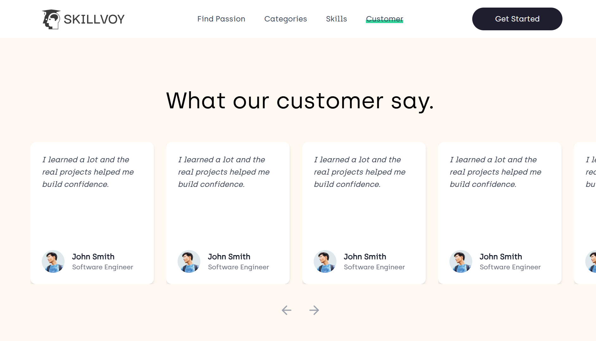

<h1 align="center">
  Skillvoy
</h1>
<div align="center">
  
</div>


## Description

Skillex is a modern service marketplace that connects users with skilled professionals — from home repair to creative work. Simple, seamless, and trusted.

## Built With

- [React.js]
- [Tailwindcss]
- [FramerMotion]
- [KeenSlider]

## 🛠 Installation & Set Up

1. Clone the repo
   ```sh
   git clone https://github.com/rdhss/skillvoy.git
   ```
1. change dir
   ```sh
   cd skillvoy
   ```
2. Install NPM packages
   ```sh
   npm install
   ```
3. Start the Application
   ```sh
   npm start
   ```

## Screenshoot

<div align="center">
  
</div>

<div align="center">
  
</div>

<div align="center">
  
</div>